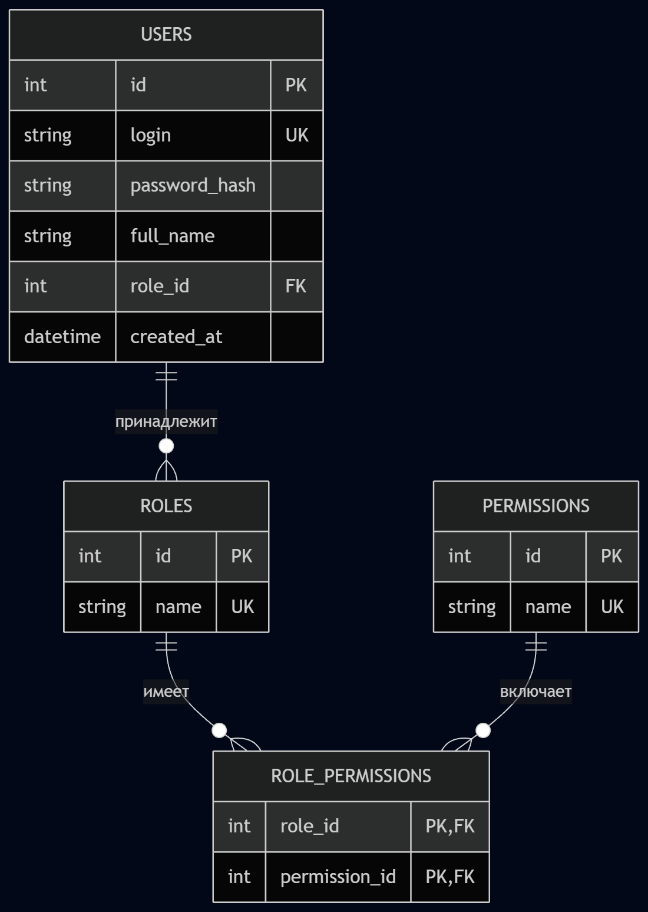

# Отчёт по проектированию базы данных учёта пользователей и ролей

## Технологии

СУБД: SQLite (встроенная, не требует установки)

Язык реализации: Python 3 (модуль sqlite3)

Среда разработки: VS Code

## Структура проекта

```text
project_db/
├── create_db.py      # скрипт создания БД, таблиц, тестовых данных и демонстрации запросов
├──create_db.sql      # то же самое, но на sql
├── database.db       # файл базы данных (создается после запуска)
└── README.md         # отчет - данный файл
```

## Этапы выполнения

### 1. Проектирование

Разработана ER-диаграмма, включающая сущности:

roles

permissions

role_permissions

users



Все таблицы находятся в третьей нормальной форме.

### 2. Создание таблиц и ограничений

Использованы:

PRIMARY KEY AUTOINCREMENT

NOT NULL, UNIQUE

FOREIGN KEY с ON DELETE CASCADE (для связей прав) и ON DELETE RESTRICT (для защиты ролей от удаления при наличии пользователей)

Индексы по полям login и role_id таблицы users

### 3. Наполнение тестовыми данными

Добавлены:

Роли: Администратор, Менеджер, Пользователь

Права: create_user, edit_user, delete_user, view_reports

Назначение прав ролям

Три пользователя с разными ролями

### 4. Реализация SQL-запросов

Скрипт автоматически выполняет и выводит результаты следующих операций:

Выборка всех пользователей с ролями (сортировка по дате)

Фильтрация по роли

Вставка нового пользователя (с проверкой уникальности логина)

Обновление данных

Удаление записи

Попытка удалить роль с привязанными пользователями (ожидаемая ошибка)

Сортировка по полному имени

Поиск по шаблону (LIKE)

Попытка вставить дубликат логина (ожидаемая ошибка)

### 5. Интерактивный режим

После демонстрации примеров пользователю предлагается ввести свои SQL-запросы вручную, что позволяет проверить любые операции.

Примеры результатов выполнения
Все пользователи с ролями:

```text
admin      | Иван Петров           | Администратор
manager1   | Мария Иванова         | Менеджер
user1      | Пётр Сидоров          | Пользователь
Попытка удалить роль «Администратор»:
```

```text
Ошибка, как и ожидалось: FOREIGN KEY constraint failed
Попытка добавить дубликат логина:
```

```text
Ошибка: UNIQUE constraint failed: users.login
```

## Запуск проекта

Установить Python 3.6+

Скачать файлы проекта

В терминале выполнить:

```bash
python create_db.py
После автоматической демонстрации можно перейти в интерактивный режим и выполнять собственные SQL-запросы.
```
